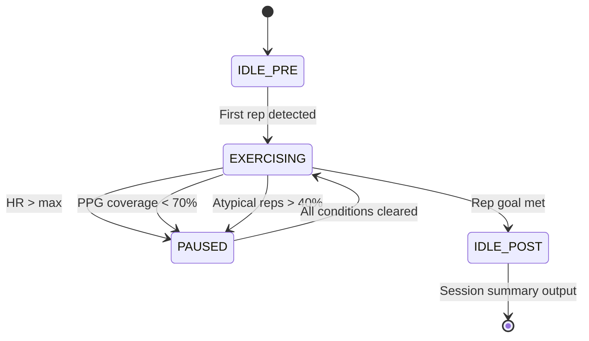

```mermaid
stateDiagram-v2
    [*] --> IDLE_PRE

    IDLE_PRE --> EXERCISING : First rep detected

    EXERCISING --> PAUSED : HR > max
    EXERCISING --> PAUSED : PPG coverage < 70%
    EXERCISING --> PAUSED : Atypical reps > 40%
    EXERCISING --> IDLE_POST : Rep goal met

    PAUSED --> EXERCISING : All conditions cleared

    IDLE_POST --> [*] : Session summary output
```